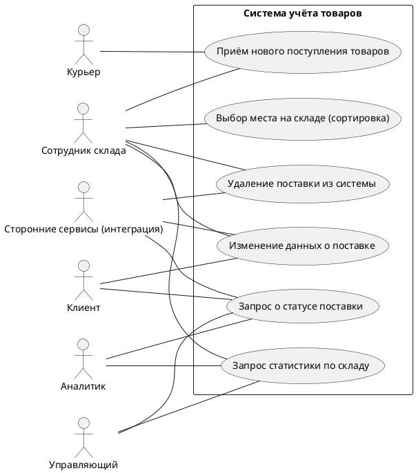

```plantuml
@startuml

skinparam packageStyle rect
left to right direction

actor Клиент
actor "Сотрудник склада"
actor "Курьер"
actor "Аналитик"
actor "Управляющий"
actor "Сторонние сервисы (интеграция)"

package "Система учёта товаров" {
usecase "Приём нового поступления товаров"
usecase "Изменение данных о поставке"
usecase "Удаление поставки из системы"
usecase "Запрос о статусе поставки"
usecase "Выбор места на складе (сортировка)"
usecase "Запрос статистики по складу"
}

Клиент -- "Запрос о статусе поставки"
Клиент -- "Изменение данных о поставке"
Курьер -- "Приём нового поступления товаров"
"Сотрудник склада" -- "Запрос статистики по складу"
"Сотрудник склада" -- "Удаление поставки из системы"
"Сотрудник склада" -- "Выбор места на складе (сортировка)"
"Сотрудник склада" -- "Приём нового поступления товаров"
"Сотрудник склада" -- "Изменение данных о поставке"
"Сторонние сервисы (интеграция)" -- "Изменение данных о поставке"
"Сторонние сервисы (интеграция)" -- "Запрос о статусе поставки"
"Сторонние сервисы (интеграция)" -- "Удаление поставки из системы"
"Аналитик" -- "Запрос статистики по складу"
"Аналитик" -- "Запрос о статусе поставки"
"Управляющий" -- "Запрос статистики по складу"
"Управляющий" -- "Запрос о статусе поставки"

@enduml
```