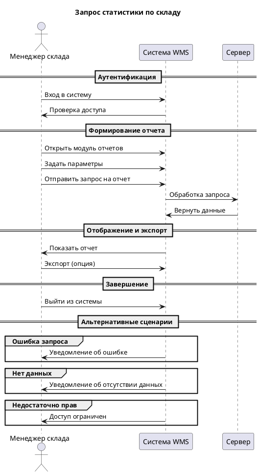

```plantuml
@startuml
actor "Менеджер склада" as warehouseManager
participant "Система WMS" as wmsSystem
participant "Сервер" as server

title Запрос статистики по складу

== Аутентификация ==
warehouseManager -> wmsSystem: Вход в систему
wmsSystem -> warehouseManager: Проверка доступа

== Формирование отчета ==
warehouseManager -> wmsSystem: Открыть модуль отчетов
warehouseManager -> wmsSystem: Задать параметры
warehouseManager -> wmsSystem: Отправить запрос на отчет
wmsSystem -> server: Обработка запроса
server -> wmsSystem: Вернуть данные

== Отображение и экспорт ==
wmsSystem -> warehouseManager: Показать отчет
warehouseManager -> wmsSystem: Экспорт (опция)

== Завершение ==
warehouseManager -> wmsSystem: Выйти из системы

== Альтернативные сценарии ==
group Ошибка запроса
    wmsSystem -> warehouseManager: Уведомление об ошибке
end

group Нет данных
    wmsSystem -> warehouseManager: Уведомление об отсутствии данных
end

group Недостаточно прав
    wmsSystem -> warehouseManager: Доступ ограничен
end

@enduml
```