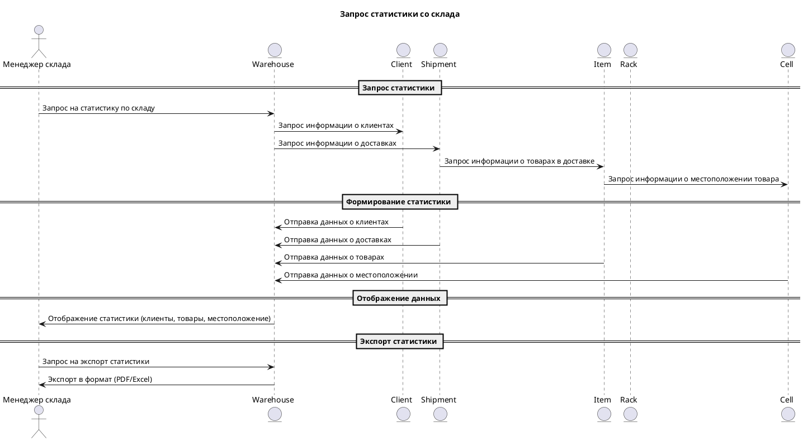

```plantuml
@startuml
actor "Менеджер склада" as warehouseManager
entity "Warehouse" as warehouse
entity "Client" as client
entity "Shipment" as shipment
entity "Item" as item
entity "Rack" as rack
entity "Cell" as cell

title Запрос статистики со склада

== Запрос статистики ==
warehouseManager -> warehouse: Запрос на статистику по складу
warehouse -> client: Запрос информации о клиентах
warehouse -> shipment: Запрос информации о доставках
shipment -> item: Запрос информации о товарах в доставке
item -> cell: Запрос информации о местоположении товара

== Формирование статистики ==
client -> warehouse: Отправка данных о клиентах
shipment -> warehouse: Отправка данных о доставках
item -> warehouse: Отправка данных о товарах
cell -> warehouse: Отправка данных о местоположении

== Отображение данных ==
warehouse -> warehouseManager: Отображение статистики (клиенты, товары, местоположение)

== Экспорт статистики ==
warehouseManager -> warehouse: Запрос на экспорт статистики
warehouse -> warehouseManager: Экспорт в формат (PDF/Excel)

@enduml
```