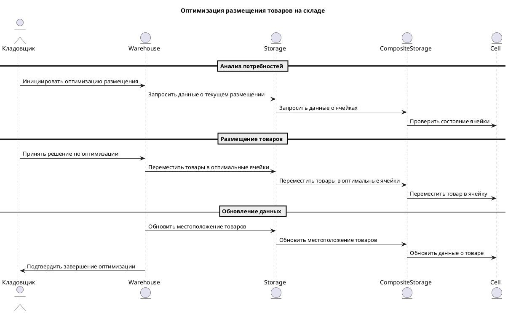

```plantuml
@startuml
actor "Кладовщик" as warehouseManager
entity "Warehouse" as warehouse
entity "Storage" as storage
entity "CompositeStorage" as compositeStorage
entity "Cell" as cell

title Оптимизация размещения товаров на складе

== Анализ потребностей ==
warehouseManager -> warehouse: Инициировать оптимизацию размещения
warehouse -> storage: Запросить данные о текущем размещении
storage -> compositeStorage: Запросить данные о ячейках
compositeStorage -> cell: Проверить состояние ячейки

== Размещение товаров ==
warehouseManager -> warehouse: Принять решение по оптимизации
warehouse -> storage: Переместить товары в оптимальные ячейки
storage -> compositeStorage: Переместить товары в оптимальные ячейки
compositeStorage -> cell: Переместить товар в ячейку

== Обновление данных ==
warehouse -> storage: Обновить местоположение товаров
storage -> compositeStorage: Обновить местоположение товаров
compositeStorage -> cell: Обновить данные о товаре
warehouse -> warehouseManager: Подтвердить завершение оптимизации

@enduml
```
