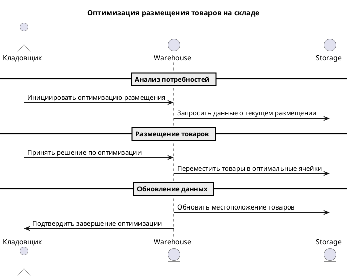

```plantuml
@startuml
actor "Кладовщик" as warehouseManager
entity "Warehouse" as warehouse
entity "Storage" as storage

title Оптимизация размещения товаров на складе

== Анализ потребностей ==
warehouseManager -> warehouse: Инициировать оптимизацию размещения
warehouse -> storage: Запросить данные о текущем размещении

== Размещение товаров ==
warehouseManager -> warehouse: Принять решение по оптимизации
warehouse -> storage: Переместить товары в оптимальные ячейки

== Обновление данных ==
warehouse -> storage: Обновить местоположение товаров
warehouse -> warehouseManager: Подтвердить завершение оптимизации

@enduml
```