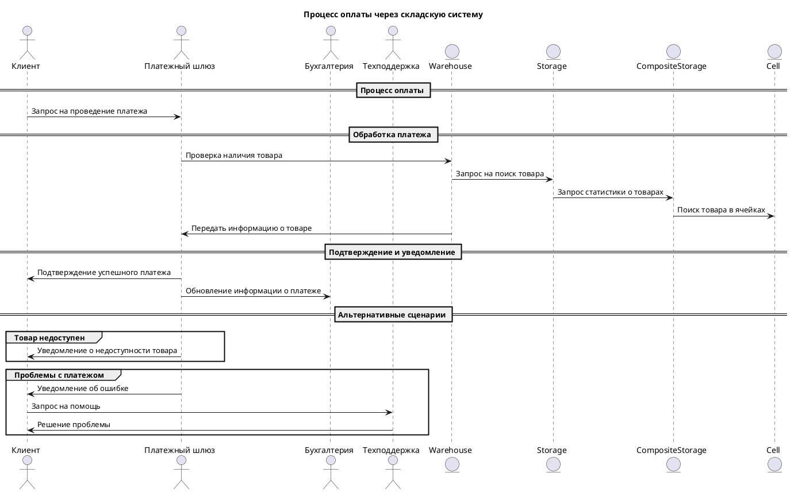

```plantuml
@startuml
actor "Клиент" as customer
actor "Платежный шлюз" as paymentGateway
actor "Бухгалтерия" as accounting
actor "Техподдержка" as support
entity "Warehouse" as warehouse
entity "Storage" as storage
entity "CompositeStorage" as compositestorage
entity "Cell" as cell 

title Процесс оплаты через складскую систему

== Процесс оплаты ==

customer -> paymentGateway: Запрос на проведение платежа

== Обработка платежа ==

paymentGateway -> warehouse: Проверка наличия товара
warehouse -> storage: Запрос на поиск товара 
storage -> compositestorage: Запрос статистики о товарах
compositestorage -> cell: Поиск товара в ячейках
warehouse -> paymentGateway: Передать информацию о товаре

== Подтверждение и уведомление ==

paymentGateway -> customer: Подтверждение успешного платежа
paymentGateway -> accounting: Обновление информации о платеже

== Альтернативные сценарии ==

group Товар недоступен
    paymentGateway -> customer: Уведомление о недоступности товара
end

group Проблемы с платежом
    paymentGateway -> customer: Уведомление об ошибке
    customer -> support: Запрос на помощь
    support -> customer: Решение проблемы
end

@enduml
```