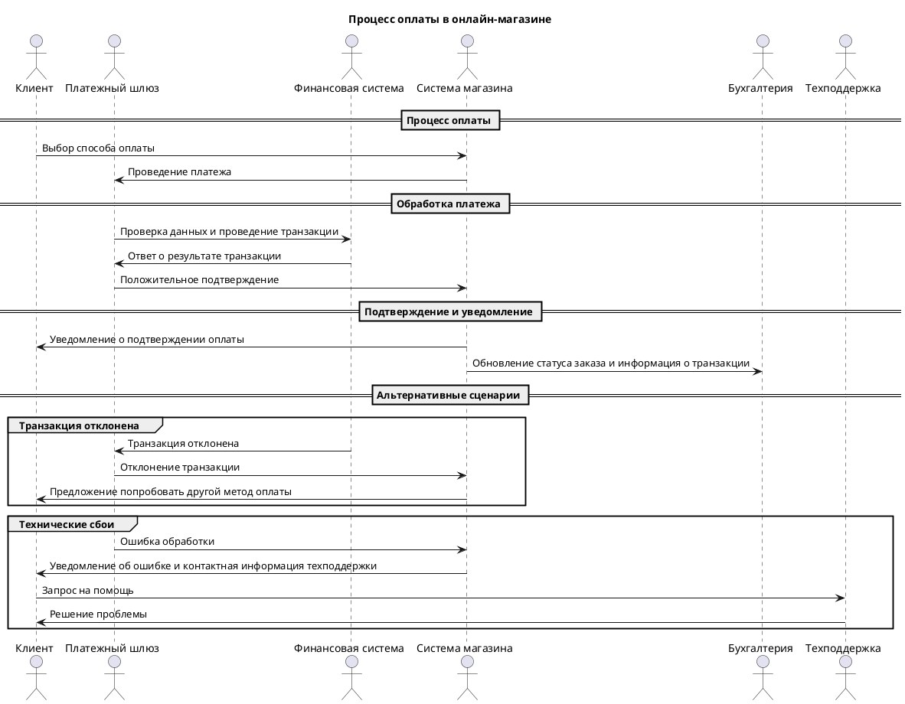

```plantuml
@startuml
actor "Клиент" as customer
actor "Платежный шлюз" as paymentGateway
actor "Финансовая система" as financialSystem
actor "Система магазина" as storeSystem
actor "Бухгалтерия" as accounting
actor "Техподдержка" as support

title Процесс оплаты в онлайн-магазине

== Процесс оплаты ==
customer -> storeSystem: Выбор способа оплаты
storeSystem -> paymentGateway: Проведение платежа

== Обработка платежа ==
paymentGateway -> financialSystem: Проверка данных и проведение транзакции
financialSystem -> paymentGateway: Ответ о результате транзакции
paymentGateway -> storeSystem: Положительное подтверждение

== Подтверждение и уведомление ==
storeSystem -> customer: Уведомление о подтверждении оплаты
storeSystem -> accounting: Обновление статуса заказа и информация о транзакции

== Альтернативные сценарии ==
group Транзакция отклонена
    financialSystem -> paymentGateway: Транзакция отклонена
    paymentGateway -> storeSystem: Отклонение транзакции
    storeSystem -> customer: Предложение попробовать другой метод оплаты
end

group Технические сбои
    paymentGateway -> storeSystem: Ошибка обработки
    storeSystem -> customer: Уведомление об ошибке и контактная информация техподдержки
    customer -> support: Запрос на помощь
    support -> customer: Решение проблемы
end

@enduml
```