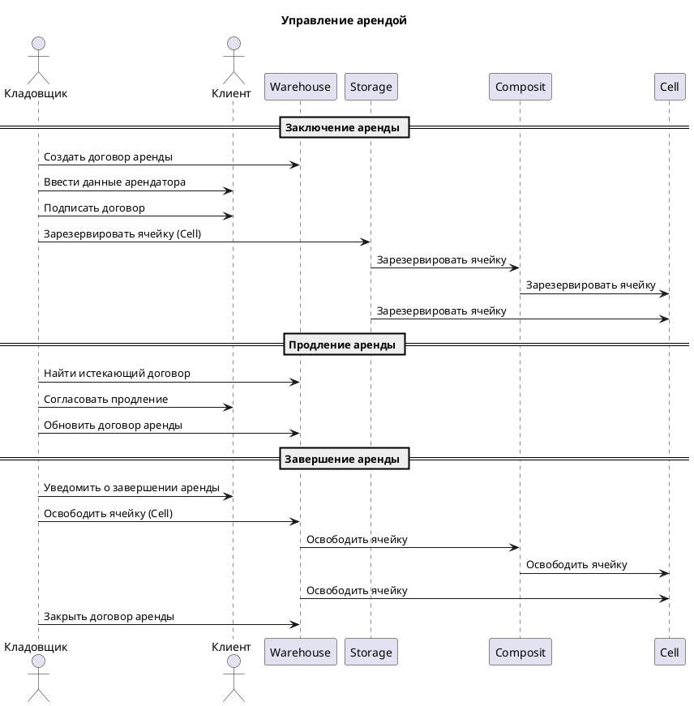

```plantuml 
@startuml
actor "Кладовщик" as warehouseManager
actor "Клиент" as client

title Управление арендой

== Заключение аренды ==
warehouseManager -> Warehouse: Создать договор аренды
warehouseManager -> client: Ввести данные арендатора
warehouseManager -> client: Подписать договор
warehouseManager -> Storage: Зарезервировать ячейку (Cell)
Storage -> Composit: Зарезервировать ячейку
Composit -> Cell: Зарезервировать ячейку
Storage -> Cell: Зарезервировать ячейку

== Продление аренды ==
warehouseManager -> Warehouse: Найти истекающий договор
warehouseManager -> client: Согласовать продление
warehouseManager -> Warehouse: Обновить договор аренды

== Завершение аренды ==
warehouseManager -> client: Уведомить о завершении аренды
warehouseManager -> Warehouse: Освободить ячейку (Cell)
Warehouse -> Composit: Освободить ячейку
Composit -> Cell: Освободить ячейку
Warehouse -> Cell: Освободить ячейку
warehouseManager -> Warehouse: Закрыть договор аренды

@enduml
```
