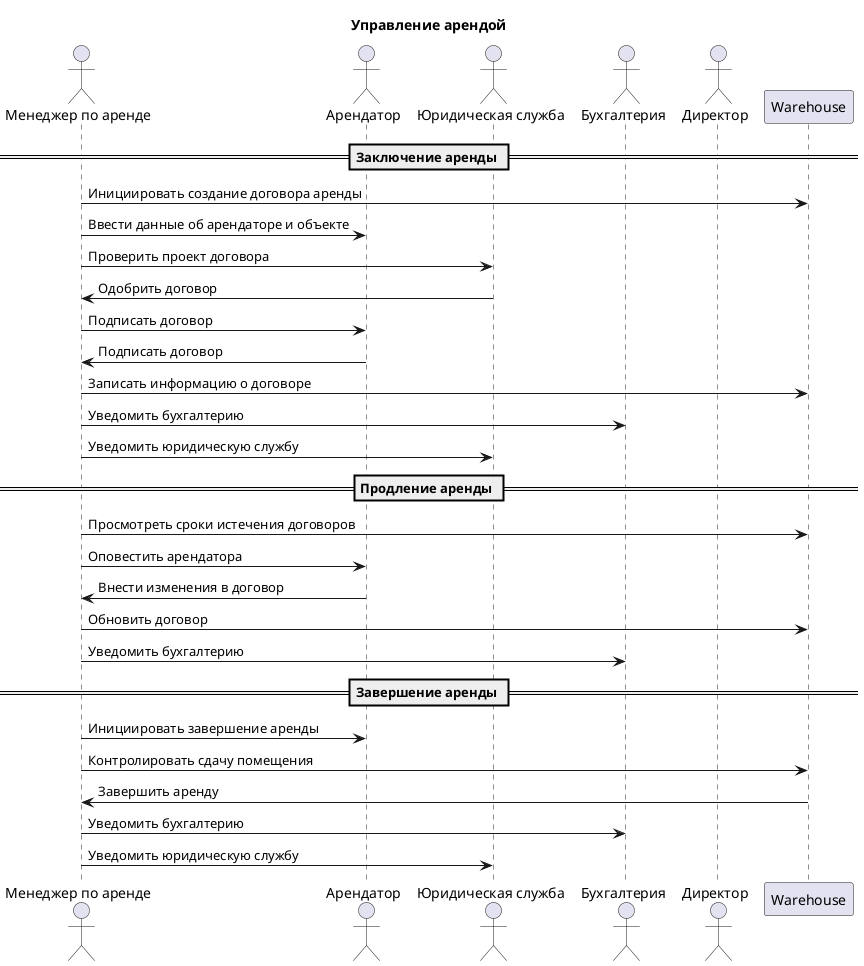

```plantuml
@startuml
actor "Менеджер по аренде" as leaseManager
actor "Арендатор" as tenant
actor "Юридическая служба" as legal
actor "Бухгалтерия" as accounting
actor "Директор" as director

title Управление арендой

== Заключение аренды ==
leaseManager -> Warehouse: Инициировать создание договора аренды
leaseManager -> tenant: Ввести данные об арендаторе и объекте
leaseManager -> legal: Проверить проект договора
legal -> leaseManager: Одобрить договор
leaseManager -> tenant: Подписать договор
tenant -> leaseManager: Подписать договор
leaseManager -> Warehouse: Записать информацию о договоре
leaseManager -> accounting: Уведомить бухгалтерию
leaseManager -> legal: Уведомить юридическую службу

== Продление аренды ==
leaseManager -> Warehouse: Просмотреть сроки истечения договоров
leaseManager -> tenant: Оповестить арендатора
tenant -> leaseManager: Внести изменения в договор
leaseManager -> Warehouse: Обновить договор
leaseManager -> accounting: Уведомить бухгалтерию

== Завершение аренды ==
leaseManager -> tenant: Инициировать завершение аренды
leaseManager -> Warehouse: Контролировать сдачу помещения
Warehouse -> leaseManager: Завершить аренду
leaseManager -> accounting: Уведомить бухгалтерию
leaseManager -> legal: Уведомить юридическую службу

@enduml
```