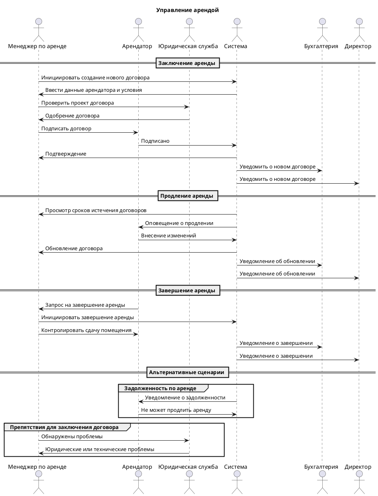

```plantuml
@startuml
actor "Менеджер по аренде" as rentalManager
actor "Арендатор" as tenant
actor "Юридическая служба" as legalDepartment
actor "Система" as system
actor "Бухгалтерия" as accounting
actor "Директор" as director

title Управление арендой

== Заключение аренды ==
rentalManager -> system: Инициировать создание нового договора
system -> rentalManager: Ввести данные арендатора и условия
rentalManager -> legalDepartment: Проверить проект договора
legalDepartment -> rentalManager: Одобрение договора
rentalManager -> tenant: Подписать договор
tenant -> system: Подписано
system -> rentalManager: Подтверждение
system -> accounting: Уведомить о новом договоре
system -> director: Уведомить о новом договоре

== Продление аренды ==
system -> rentalManager: Просмотр сроков истечения договоров
system -> tenant: Оповещение о продлении
tenant -> system: Внесение изменений
system -> rentalManager: Обновление договора
system -> accounting: Уведомление об обновлении
system -> director: Уведомление об обновлении

== Завершение аренды ==
tenant -> rentalManager: Запрос на завершение аренды
rentalManager -> system: Инициировать завершение аренды
rentalManager -> tenant: Контролировать сдачу помещения
system -> accounting: Уведомление о завершении
system -> director: Уведомление о завершении

== Альтернативные сценарии ==
group Задолженность по аренде
    system -> tenant: Уведомление о задолженности
    tenant -> system: Не может продлить аренду
end

group Препятствия для заключения договора
    rentalManager -> legalDepartment: Обнаружены проблемы
    legalDepartment -> rentalManager: Юридические или технические проблемы
end

@enduml
```