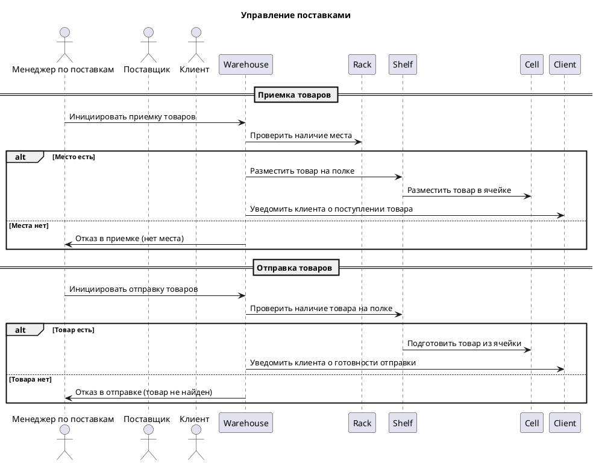

```plantuml
@startuml
actor "Менеджер по поставкам" as supplyManager
actor "Поставщик" as supplier
actor "Клиент" as customer

title Управление поставками

== Приемка товаров ==
supplyManager -> Warehouse: Инициировать приемку товаров
Warehouse -> Rack: Проверить наличие места
alt Место есть
    Warehouse -> Shelf: Разместить товар на полке
    Shelf -> Cell: Разместить товар в ячейке
    Warehouse -> Client: Уведомить клиента о поступлении товара
else Места нет
    Warehouse -> supplyManager: Отказ в приемке (нет места)
end

== Отправка товаров ==
supplyManager -> Warehouse: Инициировать отправку товаров
Warehouse -> Shelf: Проверить наличие товара на полке
alt Товар есть
    Shelf -> Cell: Подготовить товар из ячейки
    Warehouse -> Client: Уведомить клиента о готовности отправки
else Товара нет
    Warehouse -> supplyManager: Отказ в отправке (товар не найден)
end

@enduml
```