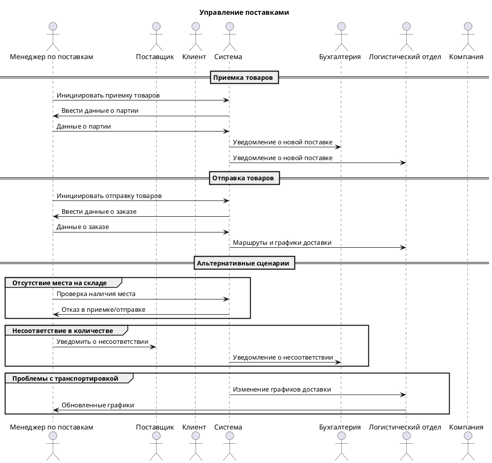

```plantuml
@startuml
actor "Менеджер по поставкам" as supplyManager
actor "Поставщик" as supplier
actor "Клиент" as customer
actor "Система" as system
actor "Бухгалтерия" as accounting
actor "Логистический отдел" as logistics
actor "Компания" as company

title Управление поставками

== Приемка товаров ==
supplyManager -> system: Инициировать приемку товаров
system -> supplyManager: Ввести данные о партии
supplyManager -> system: Данные о партии
system -> accounting: Уведомление о новой поставке
system -> logistics: Уведомление о новой поставке

== Отправка товаров ==
supplyManager -> system: Инициировать отправку товаров
system -> supplyManager: Ввести данные о заказе
supplyManager -> system: Данные о заказе
system -> logistics: Маршруты и графики доставки

== Альтернативные сценарии ==
group Отсутствие места на складе
    supplyManager -> system: Проверка наличия места
    system -> supplyManager: Отказ в приемке/отправке
end

group Несоответствие в количестве
    supplyManager -> supplier: Уведомить о несоответствии
    system -> accounting: Уведомление о несоответствии
end

group Проблемы с транспортировкой
    system -> logistics: Изменение графиков доставки
    logistics -> supplyManager: Обновленные графики
end

@enduml
```