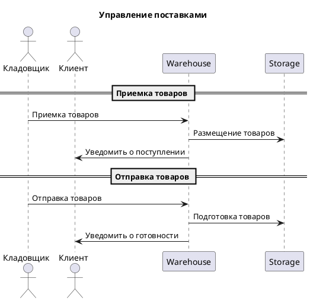

```plantuml
@startuml
actor "Кладовщик" as warehouseManager
actor "Клиент" as client

title Управление поставками

== Приемка товаров ==
warehouseManager -> Warehouse: Приемка товаров
Warehouse -> Storage: Размещение товаров
Warehouse -> client: Уведомить о поступлении

== Отправка товаров ==
warehouseManager -> Warehouse: Отправка товаров
Warehouse -> Storage: Подготовка товаров
Warehouse -> client: Уведомить о готовности

@enduml
```