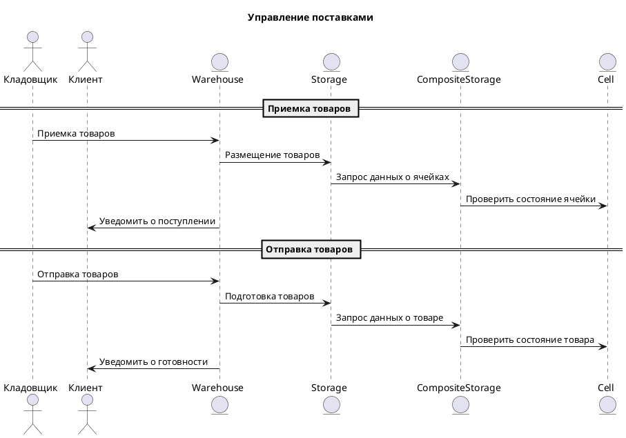

```plantuml
@startuml
actor "Кладовщик" as warehouseManager
actor "Клиент" as client
entity "Warehouse" as warehouse
entity "Storage" as storage
entity "CompositeStorage" as compositestorage
entity "Cell" as cell

title Управление поставками

== Приемка товаров ==
warehouseManager -> warehouse: Приемка товаров
warehouse -> storage: Размещение товаров
storage -> compositestorage: Запрос данных о ячейках
compositestorage -> cell: Проверить состояние ячейки
warehouse -> client: Уведомить о поступлении

== Отправка товаров ==
warehouseManager -> warehouse: Отправка товаров
warehouse -> storage: Подготовка товаров
storage -> compositestorage: Запрос данных о товаре
compositestorage -> cell: Проверить состояние товара 
warehouse -> client: Уведомить о готовности

@enduml
```