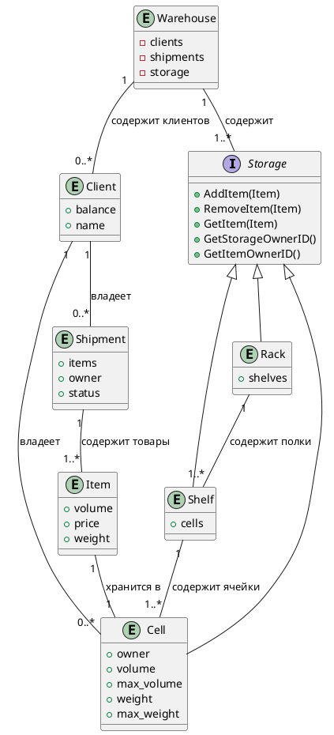

```plantuml
@startuml

interface Storage {
    +AddItem(Item)
    +RemoveItem(Item)
    +GetItem(Item)
    +GetStorageOwnerID()
    +GetItemOwnerID()
}

entity Warehouse {
    -clients
    -shipments
    -storage
}

entity Shipment {
    +items
    +owner
    +status
}

entity Rack {
    +shelves
}

entity Cell {
    +owner
    +volume
    +max_volume
    +weight
    +max_weight
}

entity Item {
    +volume
    +price
    +weight
}

entity Client {
    +balance
    +name
}

entity Shelf {
    +cells
}

Warehouse "1" -down- "1..*" Storage : содержит
Warehouse "1" -right-- "0..*" Client : содержит клиентов
Rack "1" -down- "1..*" Shelf : содержит полки
Shelf "1" -- "1..*" Cell : содержит ячейки
Shipment "1" -- "1..*" Item : содержит товары
Item "1" -- "1" Cell : хранится в
Client "1" -- "0..*" Shipment : владеет
Client "1" -- "0..*" Cell : владеет
Storage <|-- Rack
Storage <|-- Shelf
Storage <|-- Cell

@enduml
```